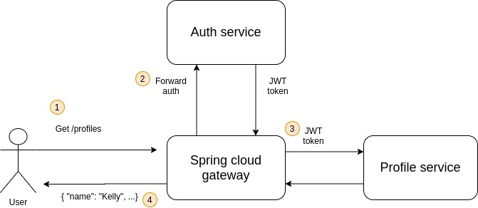

##### Архитектура решения



##### Результаты тестирования

```
→ registraition user 1
  POST http://arch.homework/otusapp/auth/registration [201 Created, 371B, 659ms]
  ✓  Status code is 201
  ✓  has location

→ registraition user 2
  POST http://arch.homework/otusapp/auth/registration [201 Created, 371B, 553ms]
  ✓  Status code is 201

→ auth user1
  POST http://arch.homework/otusapp/auth [200 OK, 570B, 782ms]
  ✓  Status code is 200

→ auth user2
  POST http://arch.homework/otusapp/auth [200 OK, 570B, 175ms]
  ✓  Status code is 200

→ create unauthorize
  POST http://arch.homework/otusapp/profiles [401 Unauthorized, 137B, 11ms]
  ✓  Status code is 401

→ create profile
  POST http://arch.homework/otusapp/profiles [201 Created, 387B, 994ms]
  ✓  Status code is 201

→ get unathorize
  GET http://arch.homework/otusapp/profiles/users/33 [401 Unauthorized, 137B, 16ms]
  ✓  Status code is 401

→ get profile
  GET http://arch.homework/otusapp/profiles/users/33 [200 OK, 522B, 412ms]
  ✓  Status code is 200

→ get profile wrong user
  GET http://arch.homework/otusapp/profiles/users/33 [400 Bad Request, 361B, 351ms]
  ✓  Status code is 400

→ update profile
  PUT http://arch.homework/otusapp/profiles/users/33 [200 OK, 352B, 73ms]
  ✓  Status code is 200

→ update profile unauthorize
  PUT http://arch.homework/otusapp/profiles/users/33 [400 Bad Request, 361B, 31ms]
  ✓  Status code is 400

┌─────────────────────────┬────────────────────┬────────────────────┐
│                         │           executed │             failed │
├─────────────────────────┼────────────────────┼────────────────────┤
│              iterations │                  1 │                  0 │
├─────────────────────────┼────────────────────┼────────────────────┤
│                requests │                 11 │                  0 │
├─────────────────────────┼────────────────────┼────────────────────┤
│            test-scripts │                 22 │                  0 │
├─────────────────────────┼────────────────────┼────────────────────┤
│      prerequest-scripts │                 13 │                  0 │
├─────────────────────────┼────────────────────┼────────────────────┤
│              assertions │                 12 │                  0 │
├─────────────────────────┴────────────────────┴────────────────────┤
│ total run duration: 4.6s                                          │
├───────────────────────────────────────────────────────────────────┤
│ total data received: 408B (approx)                                │
├───────────────────────────────────────────────────────────────────┤
│ average response time: 368ms [min: 11ms, max: 994ms, s.d.: 326ms] │
└───────────────────────────────────────────────────────────────────┘
```