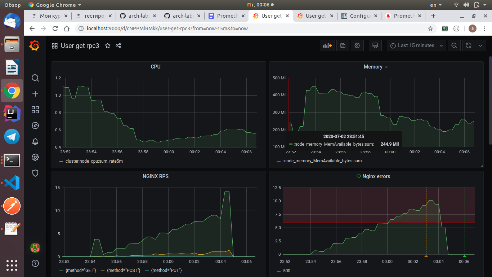
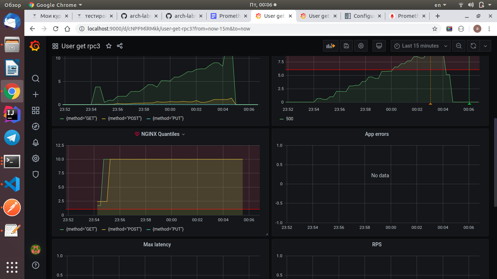
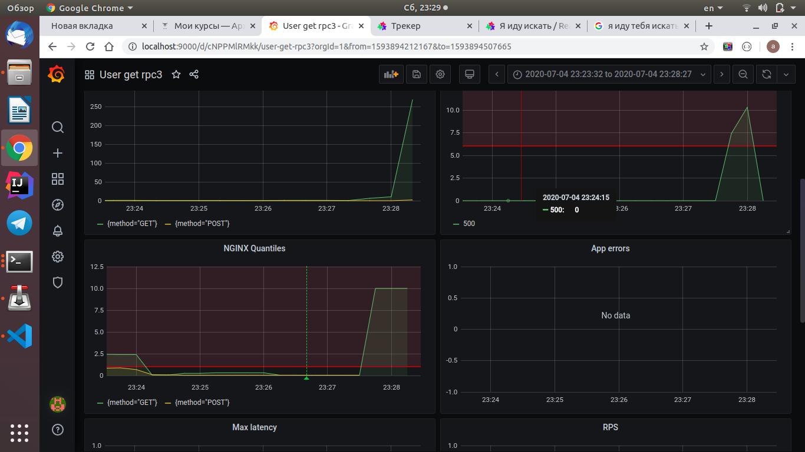
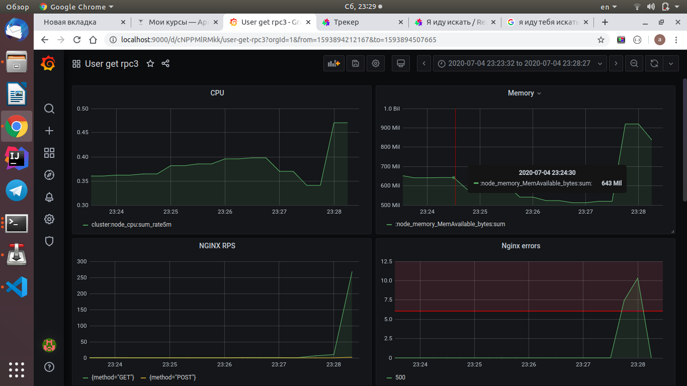

##### Описание

Кэш реализован с помощью Redis. 
Алгоритм вытеснения Least recently used. Инвалидация происходит по ключу.

`helm install mycache app-chart/`
##### Результаты тестирования

```
→ create product
  POST http://arch.homework/otusapp/products [201 Created, 168B, 495ms]
  ✓  Status code is 201

→ get product from db 
  GET http://arch.homework/otusapp/products/find?name=Delpha738&version=0 [200 OK, 284B, 1287ms]
  ✓  Status code is 200
  ✓  Response time is less than 200ms
  ✓  Your test name

→ get product from cache
  GET http://arch.homework/otusapp/products/find?name=Delpha738&version=0 [200 OK, 284B, 110ms]
  ✓  Status code is 200
  ✓  Response time is less than 200ms

→ update product
  PUT http://arch.homework/otusapp/products?id=39 [200 OK, 127B, 157ms]

→ get product with new version from db
  GET http://arch.homework/otusapp/products/find?name=Delpha738&version=1 [200 OK, 282B, 779ms]
  ✓  Status code is 200
  ✓  Response time is less than 200ms

→ get product with new version from cache
  GET http://arch.homework/otusapp/products/find?name=Delpha738&version=1 [200 OK, 284B, 20ms]
  ✓  Status code is 200
  ✓  Response time is less than 200ms

┌─────────────────────────┬─────────────────────┬────────────────────┐
│                         │            executed │             failed │
├─────────────────────────┼─────────────────────┼────────────────────┤
│              iterations │                   1 │                  0 │
├─────────────────────────┼─────────────────────┼────────────────────┤
│                requests │                   6 │                  0 │
├─────────────────────────┼─────────────────────┼────────────────────┤
│            test-scripts │                  11 │                  0 │
├─────────────────────────┼─────────────────────┼────────────────────┤
│      prerequest-scripts │                   7 │                  0 │
├─────────────────────────┼─────────────────────┼────────────────────┤
│              assertions │                  10 │                  0 │
├─────────────────────────┴─────────────────────┴────────────────────┤
│ total run duration: 3.1s                                           │
├────────────────────────────────────────────────────────────────────┤
│ total data received: 218B (approx)                                 │
├────────────────────────────────────────────────────────────────────┤
│ average response time: 474ms [min: 20ms, max: 1287ms, s.d.: 446ms] │
└────────────────────────────────────────────────────────────────────┘

```

#### Стресс тесты

Долгий ответ от бд сымитирован с помощью усыпления потока на 500мс
1) Первый стресс тест был проведен без использования кэша, после нагрузки в 1.7rps, 
90 кванитиль поднялся до 10 секунд, дальше отдавались ошибки, т.е. сервис полностью потерял 
работоспособность, но при этом поды не падали.




2) Второй тест проводился с включенным кэшем, работоспособность
сервиса значительно увеличилась, в итоге приложение упало по памяти после 8rps.





